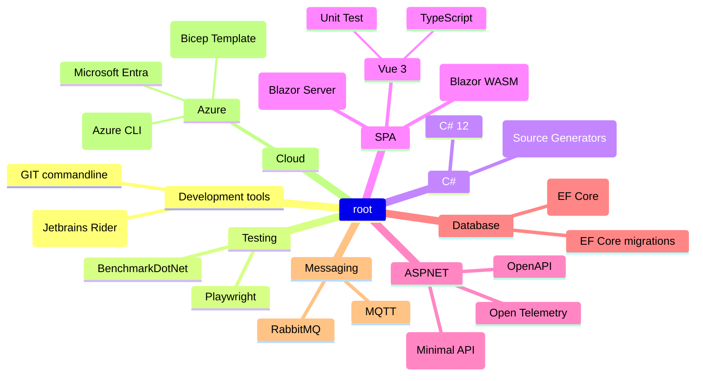

### Hi there 👋
I'm a software engineer who is passionate about creating software and extending technologies that can help in any way possible. Some technologies I enjoy working with include DotNet, AspNet, Vue, Blazor, SVG, and many others. Underneath I created a personal roadmap

<!--
**renevdhoek/renevdhoek** is a ✨ _special_ ✨ repository because its `README.md` (this file) appears on your GitHub profile.

Here are some ideas to get you started:

- 🔭 I’m currently working on ...
- 🌱 I’m currently learning ...
- 👯 I’m looking to collaborate on ...
- 🤔 I’m looking for help with ...
- 💬 Ask me about ...
- 📫 How to reach me: ...
- 😄 Pronouns: ...
- ⚡ Fun fact: ...
-->
